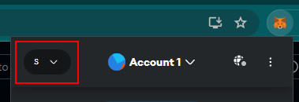
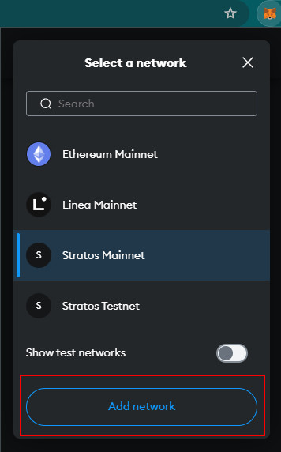
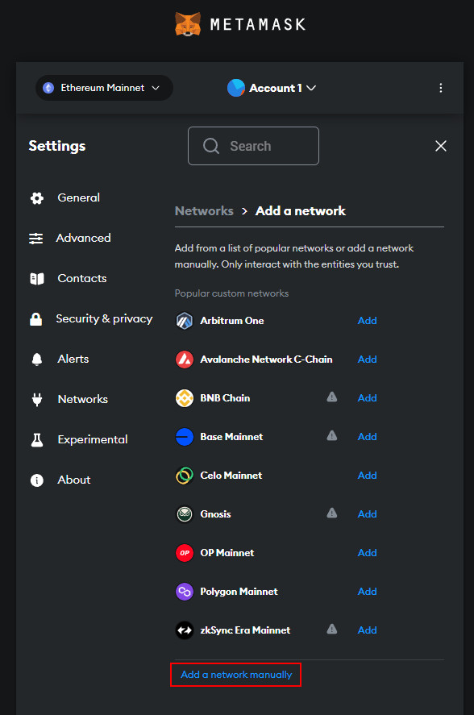
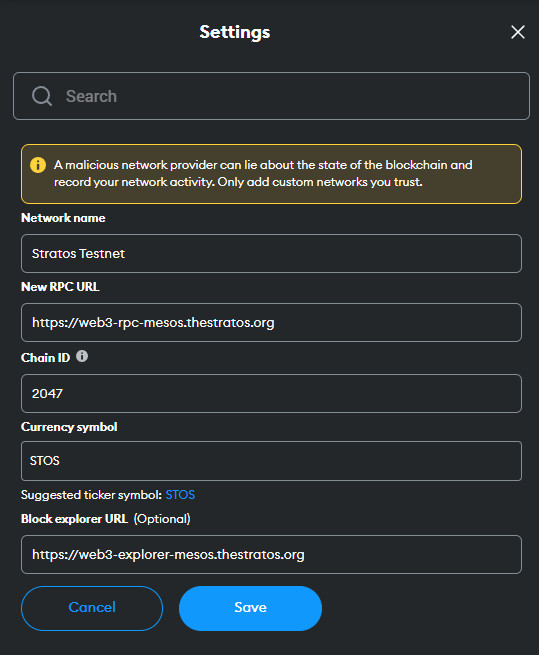

## Configure Stratos on Metamask

In order to view the flow of funds in your accounts, on the Stratos Network, you will need to configure Stratos *Mainnet* or *TestNet* URL on Metamask.

=== "Mainnet"

    To add Stratos Mainnet Network details to Metamask, follow these instructions:

    - Open Metamask and click on the networks button in the upper left corner:

    

    - Click `Add network`:

    

    - Click `Add a network manually`:

    

    - In the next screen, enter the following details and click `Save`:

    | Setting Name | Value |
    | ------------ | ----- |
    | Network name | `Stratos Mainnet` |
    | New RPC URL  | `https://web3-rpc.thestratos.org` |
    | Chain ID     | `2048` |
    | Currency symbol | `STOS` |
    | Block Explorer URL | `https://web3-explorer.thestratos.org` |

    

=== "Testnet (Mesos)"

    To add Stratos Testnet Network details to Metamask, follow these instructions:

    - Open Metamask and click on the networks button in the upper left corner:

    

    - Click `Add network`:

    

    - Click `Add a network manually`:

    

    - In the next screen, enter the following details and click `Save`:

    | Setting Name | Value |
    | ------------ | ----- |
    | Network name | `Stratos Testnet` |
    | New RPC URL  | `https://web3-rpc-mesos.thestratos.org` |
    | Chain ID     | `2048` |
    | Currency symbol | `STOS` |
    | Block Explorer URL | `https://web3-explorer-mesos.thestratos.org` |

    