## Introduction

- EXOSwap currently bridges tokens between Stratos EVM-compatible TestNet (Mesos) and Ethereum TestNet (Goerli).
- The EXOSwap Bridge is available on Mesos so users can get familiar with it before using it on MainNet with real value tokens.
- The values used in TestNet (gas amount, bridge token ratio) are random values and do not reflect the values in MainNet. 
- The operation is performed through the Metamask wallet.
- STOS tokens on Mesos TestNet have no value.

## Instructions

### Setup the network

- Open Metamask, click on network list in the upper left corner and click on "Show test networks", then click on "Goerli:

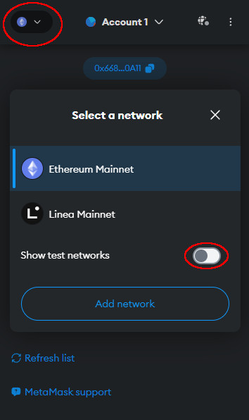 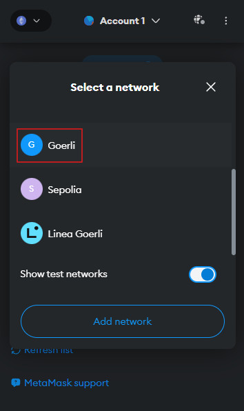

---

### Get test tokens

- You will need to get some test tokens in order to bridge them. To do that, click on the address so it gets copied to clipboard:


---

- Open a browser and point it to this URL and replace _0x0000_ with your wallet address:

```shell
https://rest-mesos.thestratos.org/stratos/evm/v1/address_convert?address=0x0000
```


- You should get a result similar to this:

```json
{
  "hex_address": "0x668304e4F0eC1CE1F4766AexF5742FA144FF0A11",
  "bech32_address": "st1v6psfe8saswwrarkdtn02ap059z07zs39jj22q"
}
```

---

- Now you can request some test tokens from our faucet. Don't forget to replace the bench32_address with your own !:
  
=== "Windows"

  	Press "Windows" button on your keyboard, type cmd and press enter. You should get a command prompt window. There, paste the following command but replace the wallet address with your own:

  	```shell
  	curl --ssl-no-revoke --header "Content-Type: application/json" --request POST --data "{\"denom\":\"stos\",\"address\":\"st1v6psfe8saswwrarkdtn02ap059z07zs39jj22q\"}" https://faucet-mesos.thestratos.org/credit
  	```

=== "Linux"

	Open a terminal and type the following command but replace the wallet address with your own:

	```shell
	curl --header "Content-Type: application/json" --request POST --data '{"denom":"stos","address":"st1v6psfe8saswwrarkdtn02ap059z07zs39jj22q"} ' https://faucet-mesos.thestratos.org/credit
	```

!!! tip

	If you run into any issues claiming the faucet, you can request some test tokens on <a href="https://t.me/StratosCommunity" target="_blank">Telegram</a> or <a href="https://discord.com/invite/tpQGpC2nMh" target="_blank">Discord</a>!

---

### Access the bridge

- <a href="https://app.exoswap.io/#/bridge" target="_blank">CLICK HERE</a> to open the bridge URL in a new tab. There, click on Connect Wallet and select Metamask:


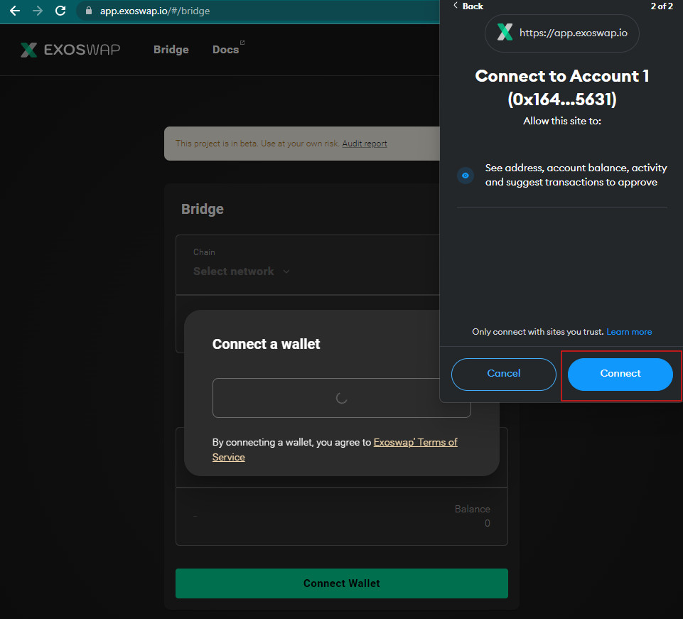

---

### Execute a transfer

- Your current transfer starts from Mesos and goes to Goerli so you have to make sure the Mesos network is the one on top. 
- You can click the middle button to reverse the networks:

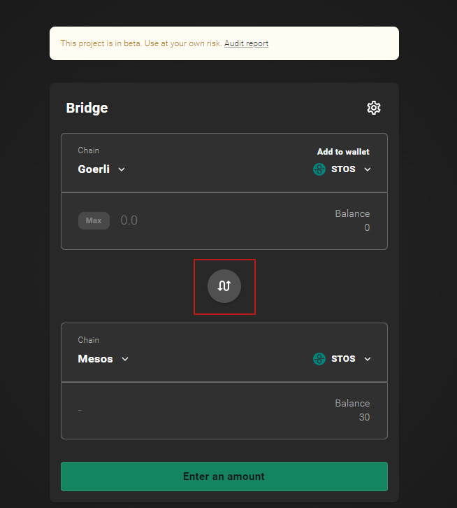

---

- Now that the Mesos network is the first, you can enter **29** as the amount and click _Transfer_:


---

- Click "Deposit" to initiate the transfer:

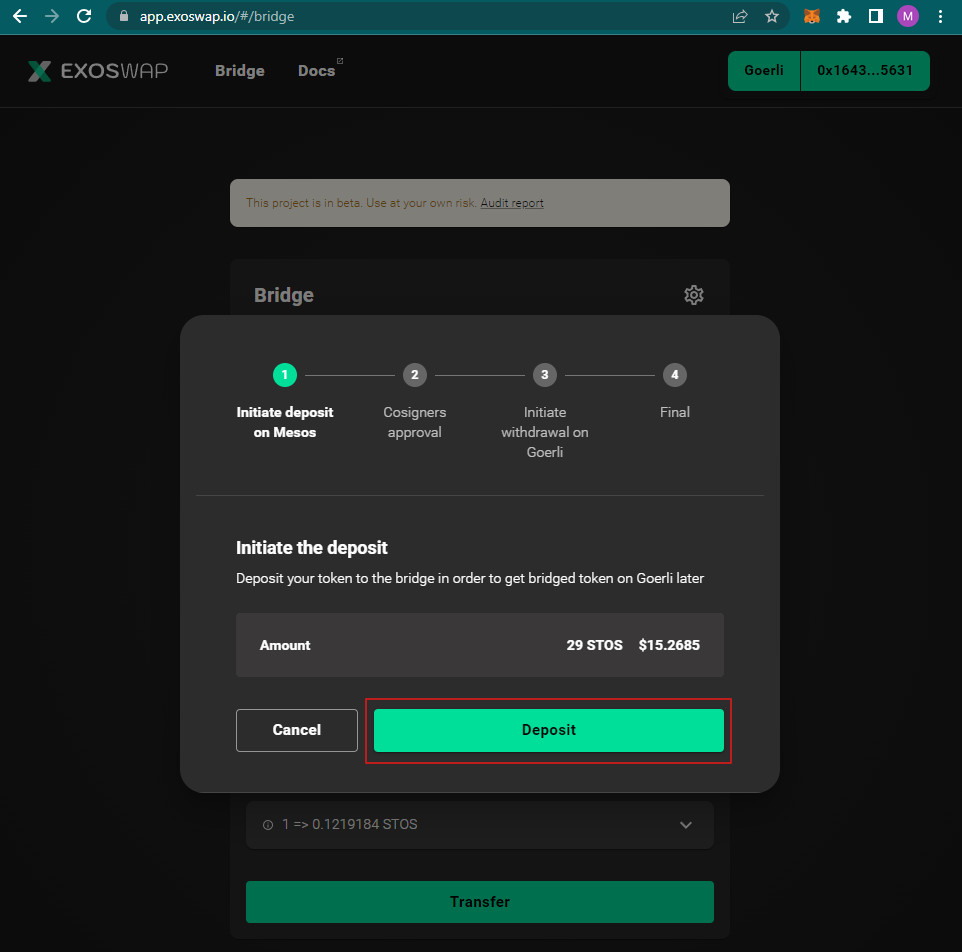

---

- Allow EXOSwap to add the Mesos Network to your Metamask:

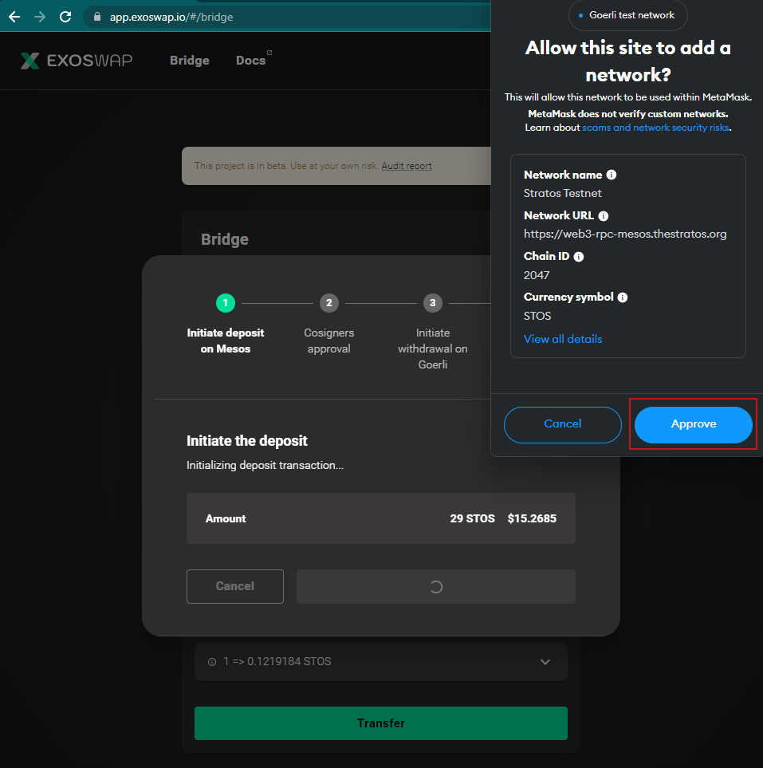

---

- Allow EXOSwap to switch the network from Goerli to Mesos:

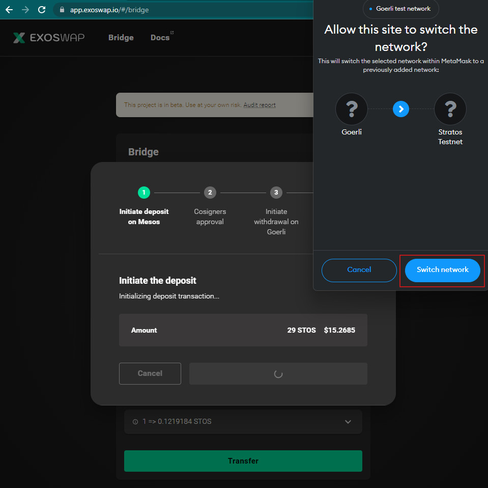

---

- Confirm the transaction:

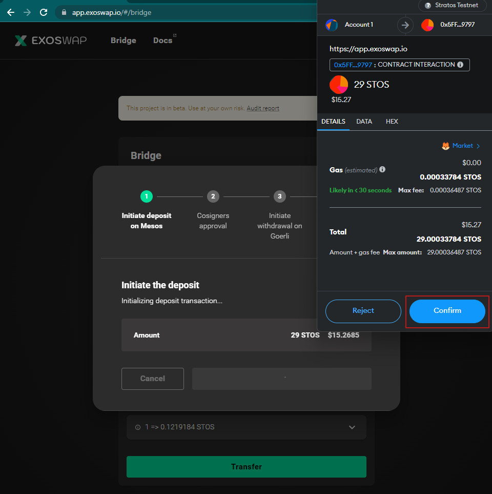

---

- Wait for transaction to be completed (could take a couple of minutes):

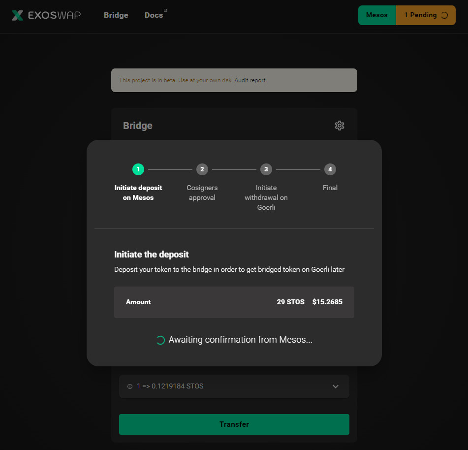
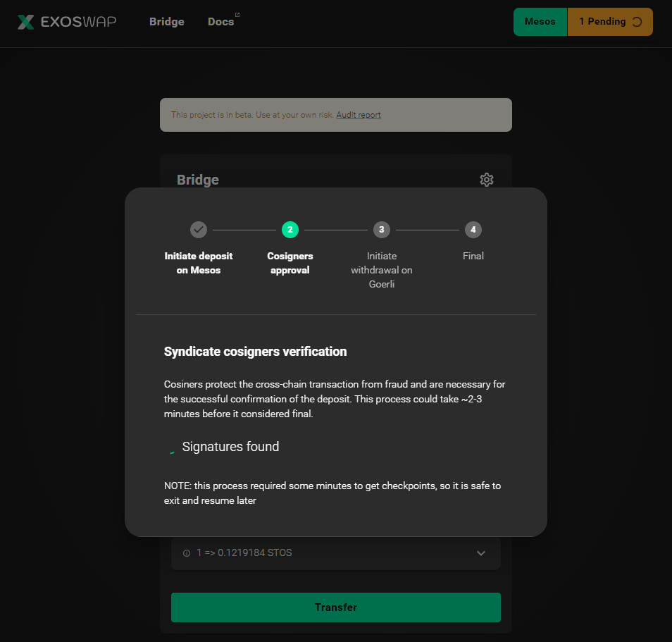

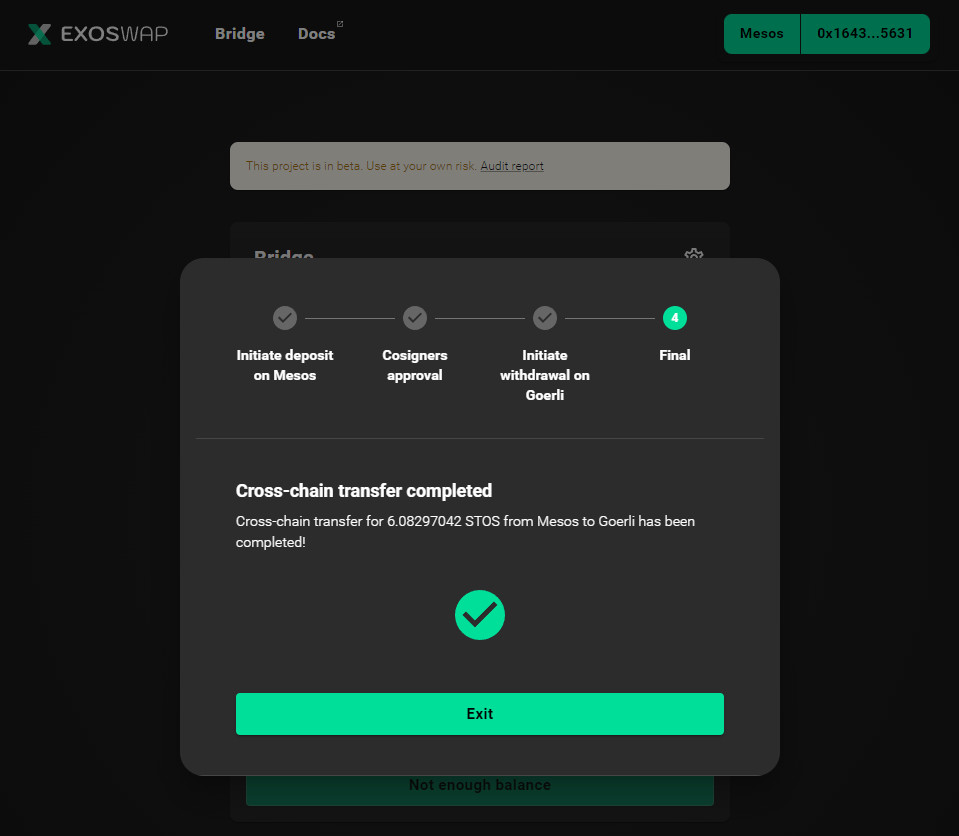

---

- You can now see your STOS balance on the Goerli Ethereum Testnet:

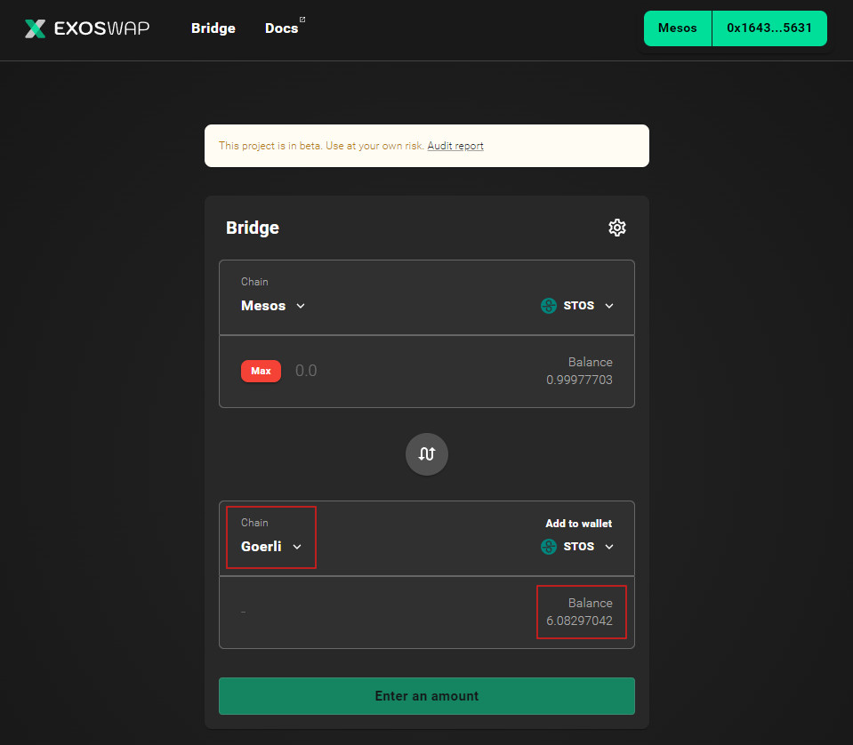

---

### Import STOS token

- Optionally, you can import the STOS token on the Ethereum Testnet. Switch back to Goerli:

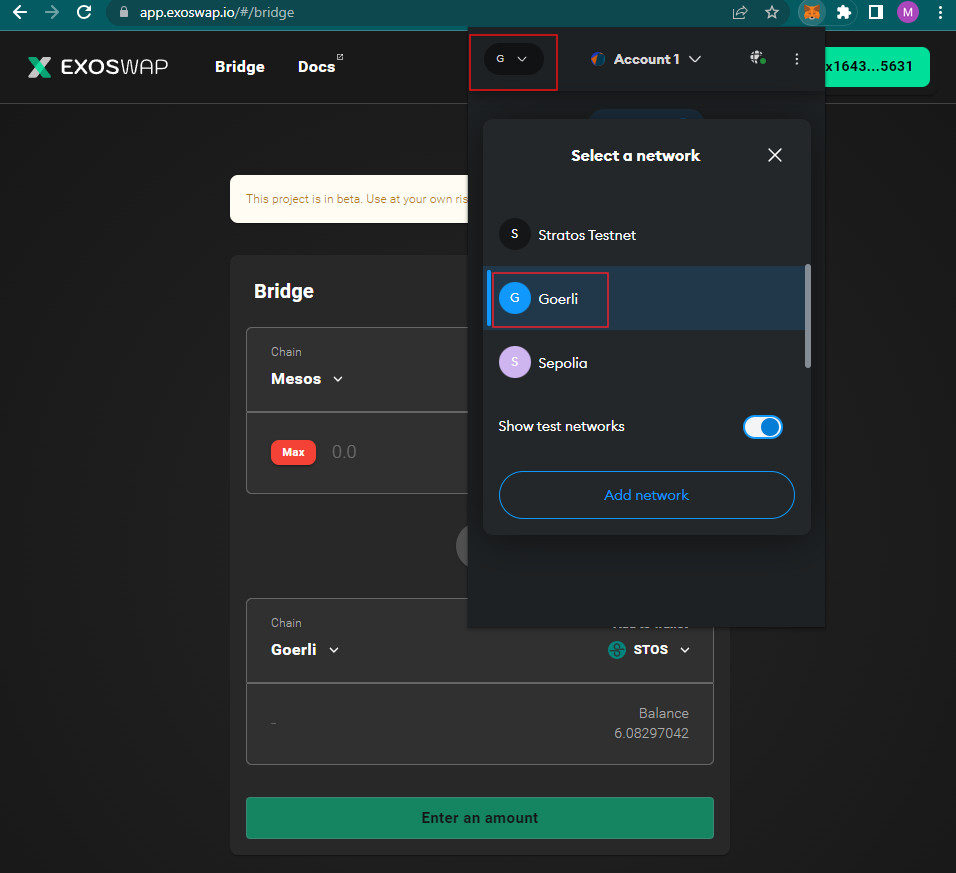

---

- Click on "Import tokens":


---

- In the "Token contract address", paste this address, the rest of the fields should get auto-filled:

```shell
0xe4A4cF37De40FE8CB5717C7e6F93dA37A104A689
```


---

- You can now see your STOS balance in Metamask on Ethereum Testnet:


---

You can also bridge them back from Goerli to Mesos but you'll need ETH test tokens to do that (which aren't that easy to get).

The same steps will need to be performed once MainNet is launched, but using the MainNet Networks in Metamask for both chains.

---