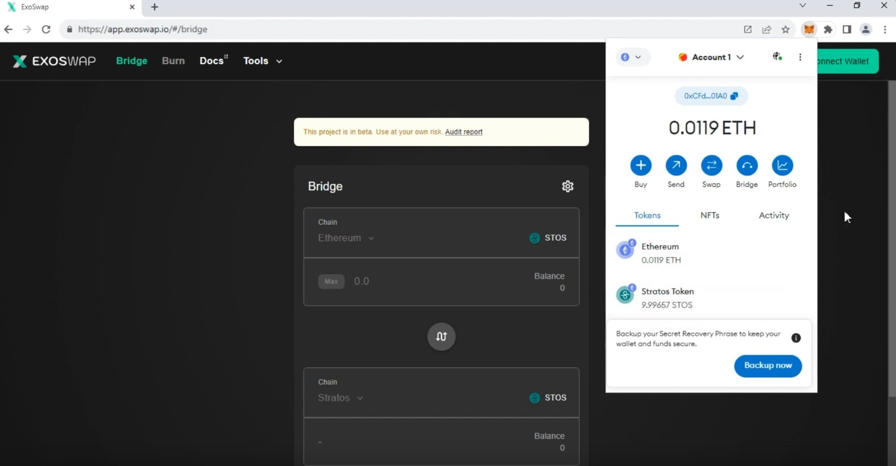
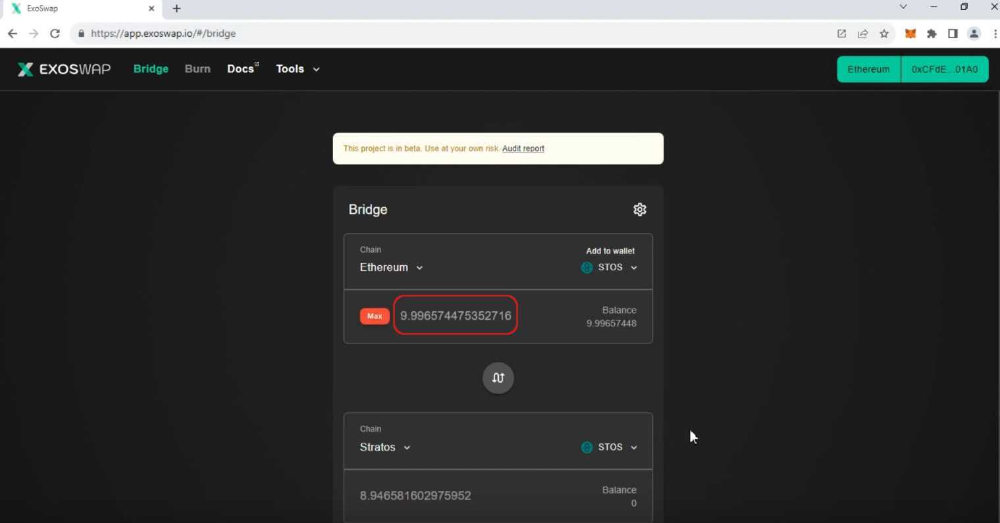
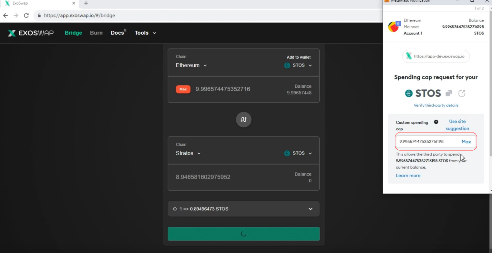
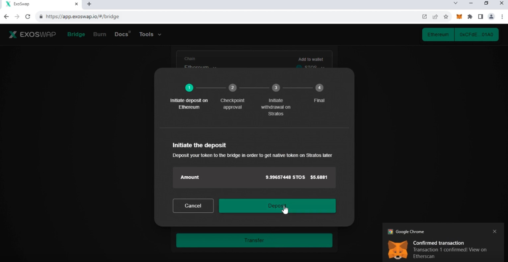
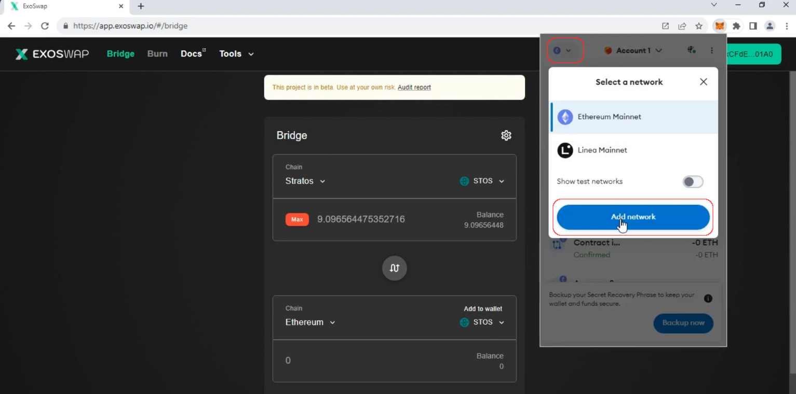
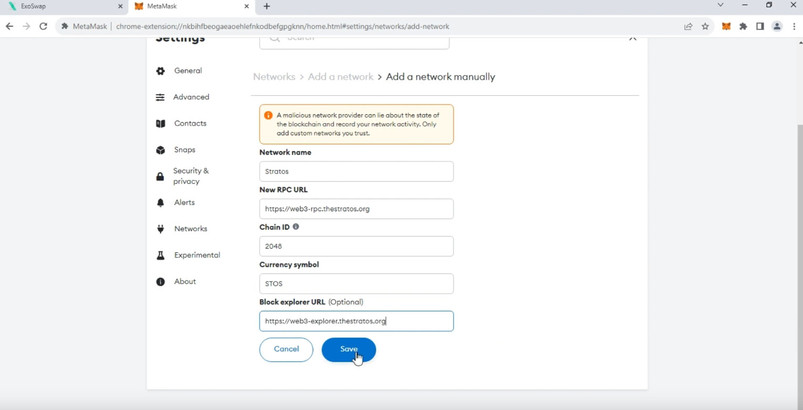
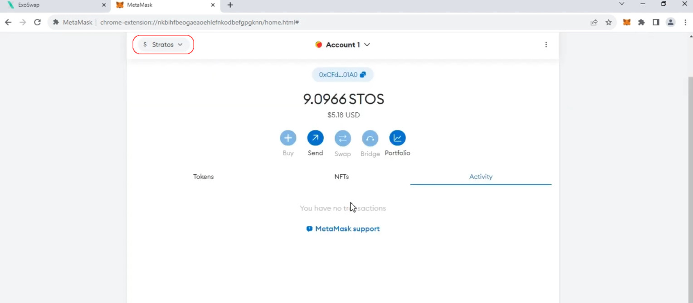
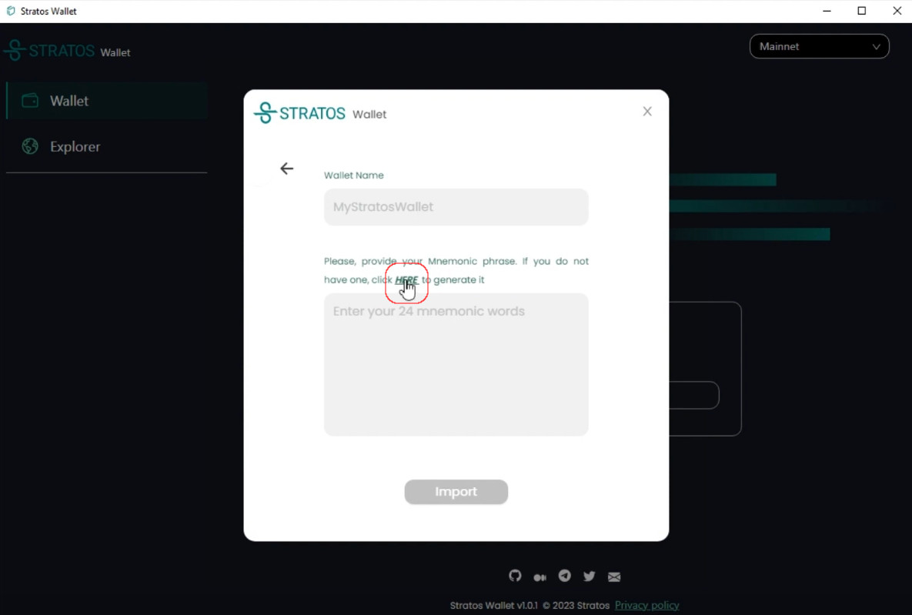
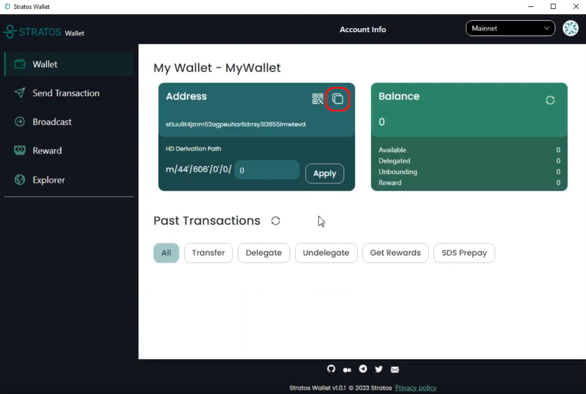
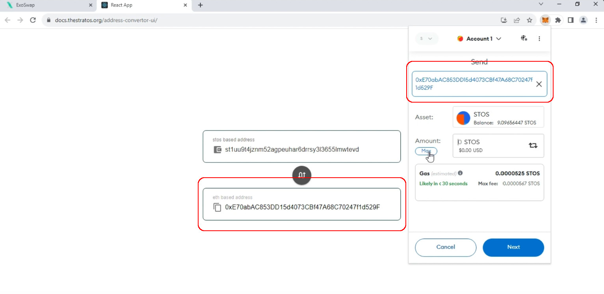

<iframe width="560" height="315" src="https://www.youtube.com/embed/DHTZxMNr_Mk?si=msBIbdwSU4aMrlba" title="YouTube video player" frameborder="0" allow="accelerometer; autoplay; clipboard-write; encrypted-media; gyroscope; picture-in-picture; web-share" allowfullscreen></iframe>

---

## Introduction

- The bridge web app is only available for Metamask.
- STOS tokens have to be on ETH network and you need some ETH for gas fees.
- If your tokens are on a CEX, you need to withdraw them to Metamask first.

---

!!! tip "WARNING"

	The **ONLY** URL for the bridge is: 

	<h1><a href="https://app.exoswap.io/" target="_blank">app.exoswap.io</a></h1>

	Always check the URL and beware of scammers!

---

## How to Bridge

- Make sure your Metamask wallet has STOS tokens as ERC-20 and some ETH for gas fee. Next, open the <a href="https://app.exoswap.io/" target="_blank">bridge URL</a> and connect the wallet.

- Enter the amount of STOS you want to bridge and click Approve.

- Approve a spending limit. Make sure you set the limit at least equal to the amount you want to bridge.

- Once the spending limit is approved, initiate the transfer. This process could take aprox. 2-3 minutes.

- Next, you need to add the Stratos Network details to Metamask. Click the upper left button and then click `Add Network`.

- In the next screen, enter the following details:

| Setting Name | Value |
| ------------ | ----- |
| Network name | `Stratos` |
| New RPC URL  | `https://web3-rpc.thestratos.org` |
| Chain ID     | `2048` |
| Currency symbol | `STOS` |
| Block Explorer URL | `https://web3-explorer.thestratos.org` |

- Your STOS tokens should now be visible on the Stratos network. 

---

## How to Stake

- Go to <a href="https://thestratos.org/download.html" target="_blank">https://thestratos.org/download.html</a> and download the Stratos Wallet.

- Import an existing wallet address or generate a new one. To generate a new one, click `Import` and the click `Here` button to generate a new mnemonic phrase.

- Copy the wallet address in the st1ABC format by clicking the copy button.

- Open the <a href="https://docs.thestratos.org/address-convertor-ui/" target="_blank">Address Convertor Page</a> and Paste the st1xxx format address in the `stos based address` field.

Next, copy the translated address in the 0xABC form.

- Go to Metamask and transfer STOS tokens to the 0xABC address.

- Go back to your Stratos Wallet and click the refresh balance button. You should see your tokens there.

- Next, go to the `Reward` tab and choose a validator. Click `Delegate` next to it and stake your coins.

- Your tokens are now staked. 

You can check back from time to time and withdraw your rewards by clicking on the `Get all rewards` button.

!!! info "Please keep in mind"

  	 - A validator's voting power will NOT affect your earning potential. Your earning will be the same, regardless of the validator you chose.

  	 - The only thing influencing your rewards if the commission amount each validator is charging. 

  	 - For the sake of decentralization, we should all make sure we keep our validators` Voting Power as equal as possible.

  	 - Your staking rewards can be withdrawn at any time but your staking DEPOSIT has a 21 days lock-down period. 

---

 