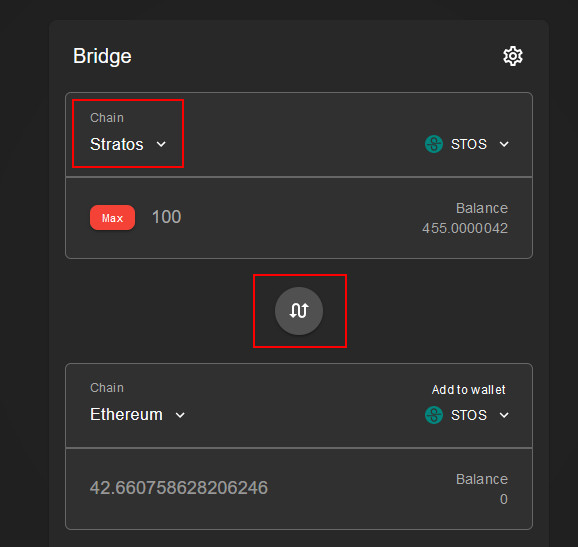

<iframe width="560" height="315" src="https://www.youtube.com/embed/DHTZxMNr_Mk?si=msBIbdwSU4aMrlba" title="YouTube video player" frameborder="0" allow="accelerometer; autoplay; clipboard-write; encrypted-media; gyroscope; picture-in-picture; web-share" allowfullscreen></iframe>

---

## Introduction

- IMPORTANT: Before proceding, make sure to download and install the latest version of Stratos Network Wallet [<a href="https://www.thestratos.org/stratos-network-wallet" target="_blank">Download</a>]
- IMPORTANT: Never send STOS directly from Ethereum network to a Stratos wallet. Migration has to go through the bridge app or else the tokens will be lost.
- The bridge web app is only available for Metamask.
- STOS tokens have to be on ETH network and you need some ETH for gas fees.
- If your tokens are on a CEX (other than Gate.io), you need to withdraw them to Metamask first. If your tokens are on Gate.io, you might be interested in withdrawing directly from Gate to Stratos Network (<a href="https://stratosmining.info/token-migration-using-gateio/" target="_blank">tutorial here</a>).
- If in doubt, please use telegram or discord to ask for assistance (links at the bottom of the page). Or, at least, send a small test transaction first, the fee will be worth the trouble if something is wrong. 

---

!!! tip "WARNING"

	The **ONLY** URL for the bridge is: 

	<h1><a href="https://app.exoswap.io/" target="_blank">app.exoswap.io</a></h1>

	Always check the URL and beware of scammers!

---

## Ethereum to Stratos

- Make sure your Metamask wallet has STOS tokens as ERC-20 and some ETH for gas fee. Next, open the <a href="https://app.exoswap.io/" target="_blank">bridge URL</a> and connect the wallet.

- Enter the amount of STOS you want to bridge and click Approve.

- Approve a spending limit. Make sure you set the limit at least equal to the amount you want to bridge.

- Once the spending limit is approved, initiate the transfer. This process could take aprox. 2-3 minutes.

- Next, you need to add the Stratos Network details to Metamask. Click the upper left button and then click `Add Network`.

- In the next screen, enter the following details:

| Setting Name | Value |
| ------------ | ----- |
| Network name | `Stratos` |
| New RPC URL  | `https://web3-rpc.thestratos.org` |
| Chain ID     | `2048` |
| Currency symbol | `STOS` |
| Block Explorer URL | `https://web3-explorer.thestratos.org` |

- Your STOS tokens should now be visible on the Stratos network. 

---

## Stratos to Ethereum

Migrating back to Ethereum network is basically the same process, but backwards.

1. Open Metamask and make sure it's connected to Stratos Network.

3. Once you see your STOS tokens in Metamask (connected to Stratos), open <a href="https://app.exoswap.io/#/bridge" target="_blank">ExoSwap</a>.

4. Change the order of the operation using the switch button in the middle and make sure the first chain is set to Stratos:

	

5. Start the transfer process.

!!! warning

	Fees for bridging from Stratos to Ethereum are quite high (out of our control, it's what Ethereum network is charging) so alternatively, you could use the <a href="https://stratosmining.info/token-migration-using-gateio/" target="_blank">migration option through Gate.io</a>.
---

 