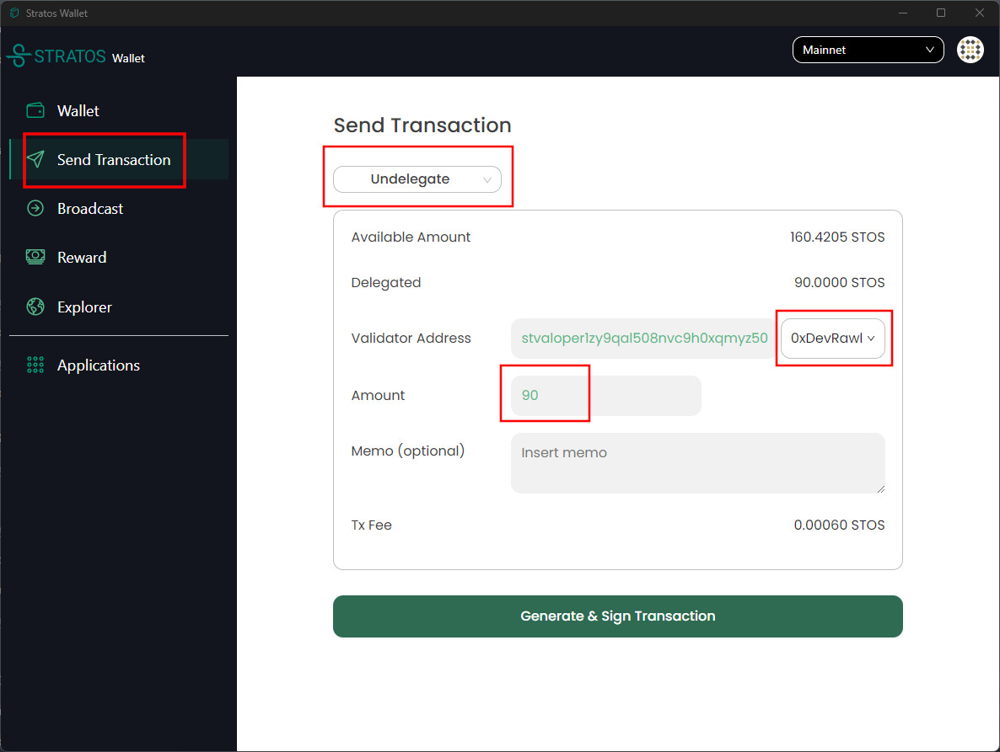
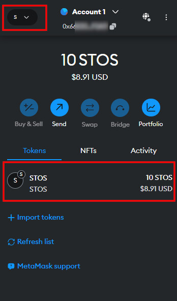
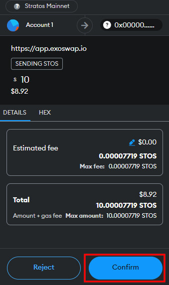
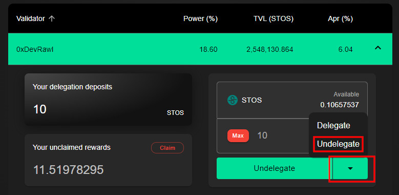
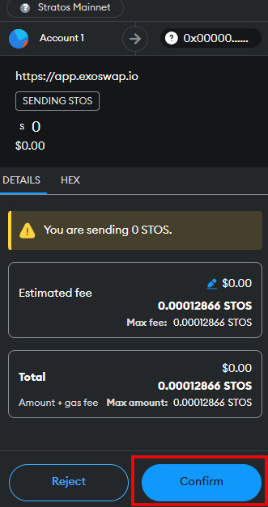

## Introduction

- IMPORTANT: Before proceding, make sure to download and install the latest version of Stratos Network Wallet [<a href="https://www.thestratos.org/stratos-network-wallet" target="_blank">Download</a>].
- If your tokens are on the ETH network or on a CEX, you need to bridge them to Stratos Network <a href="https://docs.thestratos.org/docs-stratos-chain/mainnet-bridge/" target="_blank">tutorial here</a>.
- If in doubt, please use telegram or discord to ask for assistance.  
- Please choose carefully your staking metwork (Stratos Wallet OR MetaMask) as you won't be able to import one wallet into another (they are using different type of seed phrase). The only way to switch from a wallet type to another is by unstaking and then sending the tokens to the other wallet type, but that will take 21 days.

---

!!! tip "WARNING"

	The **ONLY** URL for the bridge and staking is: 

	<h1><a href="https://app.exoswap.io/" target="_blank">app.exoswap.io</a></h1>

	Always check the URL and beware of scammers!

---

## Using Stratos Wallet

- Go to <a href="https://www.thestratos.org/stratos-network-wallet" target="_blank">thestratos.org/stratos-network-wallet</a> and download the Stratos Wallet.

- Import an existing wallet address or generate a new one. To generate a new one, click `Create or Import Wallet` and the click `Generate new Mnemonic` button to generate a new seed phrase.

!!! warning ""
	Please keep your seed phrase in a safe location. You won't be able to retrieve it again from the wallet application!

- Copy the wallet address in the st1ABC format by clicking the copy button.

- Open the <a href="https://docs.thestratos.org/address-convertor-ui/" target="_blank">Address Convertor Page</a> and Paste the st1xxx format address in the `stos based address` field.

Next, copy the translated address in the 0xABC form.

- Go to Metamask and transfer STOS tokens to the 0xABC address.

- Go back to your Stratos Wallet and click the refresh balance button. You should see your tokens there.

- Next, go to the `Reward` tab and choose a validator. Click `Delegate` next to it and stake your coins.

- Your tokens are now staked. 

You can check back from time to time and withdraw your rewards by clicking on the `Get all rewards` button.

---

### Unstake with Stratos Wallet

- To unstake your tokens, open the Stratos Wallet, go to `Send Transaction`, choose transaction type `Undelegate`, select the validator you want to unstake from, enter amount and generate the transaction.

!!! warning 
	There is a 21 days cool-down period so you will receive your unstaked coins back into your wallet after 21 days.

---

## Using MetaMask

- To stake your STOS tokens to a validator on Stratos Chain using MetaMask, your STOS tokens must be on the Stratos Network and your MetaMask must be connected to Stratos Chain.
 
- Once you completed the <a href="https://docs.thestratos.org/docs-stratos-chain/mainnet-bridge/" target="_blank">Ethereum to Stratos bridge</a>, you should find your STOS tokens in your MetaMask account connected to Stratos Network.

 

- Open <a href="https://app.exoswap.io/" target="_blank">app.exoswap.io</a>. Navigate to `Staking` and connect your MetaMask wallet.

 

- Choose any validator in the list and enter the desired amount of tokens you would want to stake, then press `Delegate`.

!!! warning ""
	Do not use `MAX`, leave at least 0.01 STOS in balance to cover the transaction fees.

 

- Confirm the transaction.

 

- Your STOS is now delegated and earning staking rewards.

- You can claim the rewards anytime and re-stake them but always remember to leave a small amount to cover for the transaction fees.

 

---

### Unstake with MetaMask

- Open <a href="https://app.exoswap.io/" target="_blank">app.exoswap.io</a>. Navigate to `Staking` and connect your MetaMask wallet.

- Open the validator you staked to and click on the drop down menu under amount details and select `Undelegate`. 

 

- Select the amount of tokens you want to undelegate and press the `Undelegate` button to process the transaction. 

- MetaMask will ask you to confirm the transaction. 

- After 21 days, you will receive your rewards back in your balance.

---

!!! info "Please keep in mind"

  	 - A validator's voting power will NOT affect your earning potential. Your earning will be the same, regardless of the validator you chose.

  	 - The only thing influencing your rewards if the commission amount each validator is charging. 

  	 - For the sake of decentralization, we should all make sure we keep our validators` Voting Power as equal as possible.

  	 - Your staking rewards can be withdrawn at any time but your staking DEPOSIT has a 21 days lock-down period. 

---

 