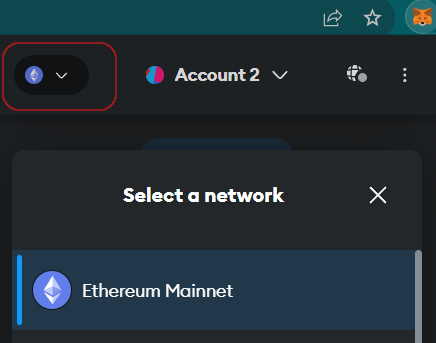
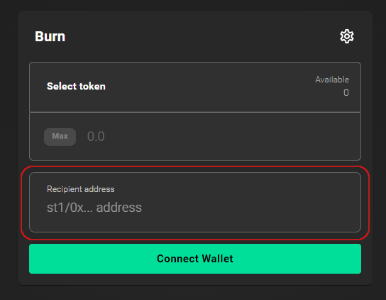
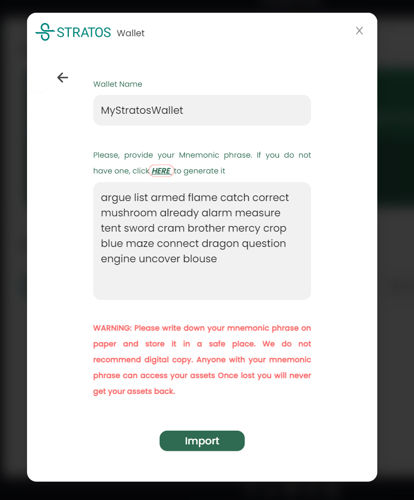
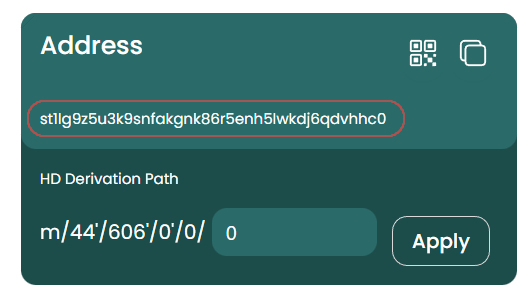
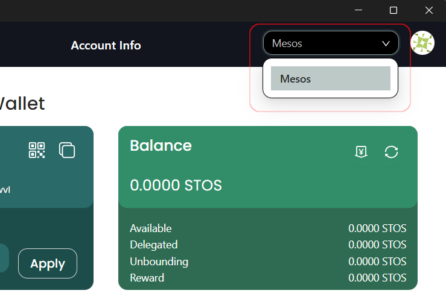

## Introduction

- The Pre-Mainnet Token Burn feature is aimed at users that want to have their STOS tokens available right at the start of the Stratos Chain (eg. Validator Operators). It will be available between 7-13 Sept.
- Users can also migrate ERC20 tokens using the bridge anytime after Mainnet launch. Bridge will be available indefinitely starting with 24 Sept.
- The Burn/Migration feature is optional. ERC20 tokens will continue to co-exist alongside our native coin so users that are not interested in running a validator or delegating (staking), are not supposed to take any action.
- The operation is performed through the Metamask wallet.

## Instructions

### Open the ExoSwap URL

The Burn function is integrated into the ExoSwap app available at

<a href="https://app.exoswap.io" target="_blank">https://app.exoswap.io</a>

!!! warning

	Always make sure your browser is pointed to the correct URL and avoid clicking on links received in DMs, there are a lot of scammers these days.

---

### Setup the network

- Open Metamask, click on network list in the upper left corner and make sure **Ethereum Mainnet** is selected:



---

### Recipient address

Once you are on the Burn page, you will see the following form:



After you entered the amount of tokens you want to burn, you will need to insert the wallet address that will be receiving the tokens.

The wallet address you enter here will be included with the corresponding token amount on Mainnet launch so you need to gain access to it after the launch.

There are two ways to achieve this:

---

#### Method 1: st1 address

Stratos chain uses the st1 wallet format. This is an example of a Stratos chain native wallet address:

`st1ujjv7d77grlgedt303lxly76x7ssff5f5eq9ds`

- Download and install the <a href="https://www.thestratos.org/download.html" target="_blank">Stratos Wallet</a>.
- Click **Sign In**, **Import Wallet**.
- Enter a name for your new wallet and click generate mnemonic phrase:



- Save the mnemonic phrase somewhere safe.
- Once you click **Import**, and set a PIN, you will see your own st1 wallet in the Address card.



- You can now use this wallet address as the Recipient Address on the Burn page.

=== "Validators next steps"

	As a validator, after Mainnet has been launched, you are supposed to have a running and synched full-chain node so you can use the stchaind binary to import the mnemonic phrase on Mainnet:

	```sh
	stchaind keys add myWallet1 --recover --hd-path="m/44'/606'/0'/0/0" --keyring-backend=TBA  
	```

	The mnemonic phrase will generate the same wallet address, regardless of the network (Mainnet or Mesos).

=== "Delegators next steps"

	- Once Mainnet is launched, Stratos Wallet will be updated and a `MainNet` network will be available in the upper right corner alongside the `Mesos` testnet network:

	

	- You can either login with this wallet and switch the network to `Mainnet` and you will see your tokens there.
	- Or, if you want to use another computer, you can re-install the Stratos Wallet and import the mnemonic phrase for the wallet you generated earlier.
	- It doesn't matter if you delete the wallet application. That mnemonic phrase will generate the exact same wallet address, on both Testnet and Mainnet.

---

---

#### Method 2: 0x address

Stratos Chain is EVM compatible so you can insert your current ETH wallet address as the Recipient.

- Once Mainnet is launched, you will need to add the <a href="https://chainlist.org/chain/2048" target="_blank">Stratos Mainnet Network</a> to your MetaMask.
- Switch the network to Stratos Mainnet.
- You will find your tokens there.

=== "Validators next steps"

	If you used the 0x method, after Mainnet launch, you will need to create a wallet on Stratos chain and transfer the tokens to the newly created wallet.

	- Install and run the full-chain node, wait to fully sync and create a new wallet using the stchaind binary:

	```sh
	stchaind keys add myWallet1 --hd-path="m/44'/606'/0'/0/0" --keyring-backend=TBA
	```

	- Copy the new st1xxx wallet and use the address convertor tool to translate the `st1` wallet address to a `0x` wallet address:

	<a href="https://docs.thestratos.org/address-convertor-ui/" target="_blank">https://docs.thestratos.org/address-convertor-ui/</a>

	- Copy the `0x` wallet address and use MetaMask to transfer the tokens from the wallet you used as recipient in the burn process, to the newly created wallet.

	- Your tokens should be now available in the newly created address so you can continue the guide on becoming a validator.


=== "Delegators next steps"

	!!! warning

		The delegation (staking) operation is performed through the Stratos Wallet, it can't be performed through MetaMask.

	In order to delegate your tokens to a validator, you will need the tokens to be accessible in the Stratos Wallet so you will need to follow a few extra steps to transfer the tokens from the MetaMask wallet to a Stratos wallet:

	- Download and install the <a href="https://www.thestratos.org/download.html" target="_blank">Stratos Wallet</a>.
	- Click **Sign In**, **Import Wallet**.
	- Enter a name for your new wallet and click generate mnemonic phrase:

	

	- Save the mnemonic phrase somewhere safe.
	- Once you click **Import**, and set a PIN, you will see your own st1 wallet in the Address card.

	

	- Load the following URL in your browser. Link is also available on ExoSwap menu.

	<a href="https://docs.thestratos.org/address-convertor-ui/" target="_blank">https://docs.thestratos.org/address-convertor-ui/</a>

	The address conversion tool translates 0x addresses to st1 format and vice-versa:

	

	- As you can see, this tool converted the st1 address you just created to a 0x EVM compatible address (basically they both point to the same wallet).
	- Now you need to open MetaMask on Stratos Network and send the STOS to the newly created wallet using the 0x form.
	- Your STOS tokens should now be visible in the Stratos Wallet.

---
